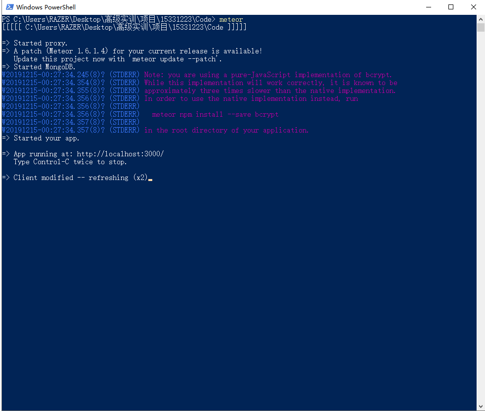
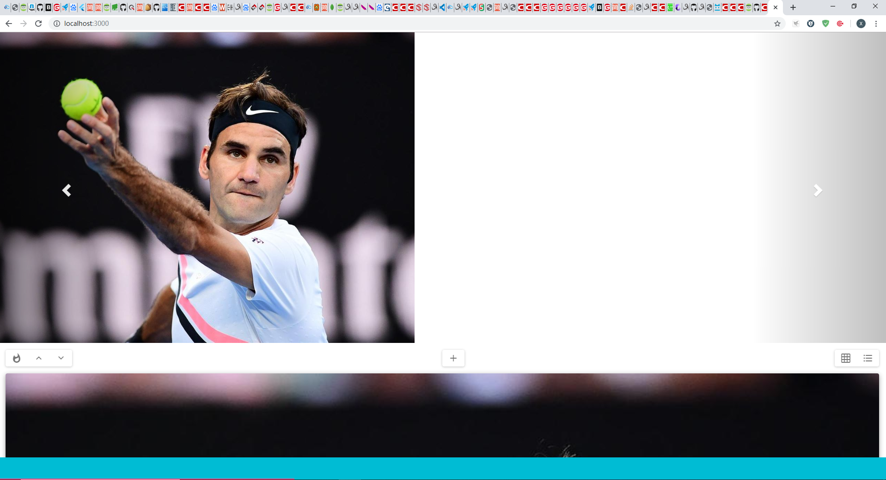

# 1. 系统配置

## 1.1 系统环境配置

本项目开发系统环境为win 10；同时项目也部署于云服务器中，系统环境为Ubuntu 16.04。

## 1.2 系统依赖配置
 
1. Nodejs 配置：本项目基于Nodejs开发，Nodejs版本

2. Meteor 配置：本项目使用Meteor框架开发，Meteor版本

3. npm 配置：本项目使用npm对Nodejs依赖包进行管理，npm版本

4. 端口配置：本项目运行于3000端口，运行前请确保此端口未被占用。

# 2. 模块安装与配置

在项目根目录下执行命令`meteor npm install`安装所需依赖包。

# 3. 项目部署运行

本地部署运行步骤：

1. 按照第1部分及第2部分的要求，配置相应环境，安装相关框架及依赖。

2. 使用命令`meteor`运行整个项目，`--port`参数可改变项目运行端口，默认运行于3000端口。

3. 使用浏览器访问`localhost:3000`即可。

4. 若要使用手机访问则将`localhost`替换成手机与本地同时连接的WLAN地址，校园网不行，必须局域网。

 
                成功运行在本地  
  
         浏览器打开，点击f12用调试台调整比例  
