#目录 Catalog

一、需求分析   
1.1 问题陈述   
1.2 用例析取   
1.3 用例规约   
1.3.1 会员注册   
1.3.2 考勤   
1.3.3 发布活动   
1.3.4 活动报名   
1.3.5 查看会员信息   
1.4 术语表   
二、架构设计   
2.1 架构描述   
2.2 关键抽象   
三、用例分析   
3.1 注册用户用例分析   
3.2 会员签到用例分析   
3.3 发布活动用例分析   
3.4 活动报名用例分析   
3.5 分析机制    
3.6 合并分析类   
四、子系统及其接口设计    
4.1 确定设计类   
4.2 定义子系统   
五、 分析系统并发需求   
5.1 分析系统并发需求   
5.2 针对报名人数问题的解决方案设计   
5.3 生命周期   
六、UI设计及功能展示   
6.1 普通用户  
6.2 管理员   
6.3 用户与管理员共享  

##一、需求分析
###1.1 问题陈述
作为在校大学生，平时除了紧张的学习生活外，大多数同学都会参与到社团活动中。许多社团会招收大量的会员，开展一系列丰富有趣的社团活动。由于招收会员人数众多，社团的管理人员在进行管理时所面临的问题也随之变得复杂。传统的社团管理方式往往存在一些弊端：  

（1）社团会员注册一般采用纸质登记的方式，再由干事输入Excel表格；有些则利用问卷星等工具，可直接获得Excel表格。这种方式记录的会员信息在后期使用上灵活性较低，往往需要管理人员进行大量手动操作。  
（2）会员活动考勤一般采用纸质登记的方式，再由干事输入Excel表格。这种方式存在一些漏洞，比如帮签。  
（3）活动报名方面，大多数情况下，即便管理人员已经拥有会员信息，也需要会员另外再次填写报名信息，不但会员需要反复填写，干事也需要再次整理资料，效率很低。  

为了解决以上问题，我将开发一个会员管理系统，采用B/S结构。该系统在会员第一次登记的时候，需要填写基本信息，包括姓名、性别、学号、专业、电话、邮箱等，这些数据将被记录在服务器的数据库中，会员可利用用户名和密码登录系统。登陆后，会员可以看到个人信息、最近活动、已参与活动等信息，在活动详情中可以报名，报名信息将直接从数据可调用，而无需重复填写。若某个活动需要签到，会员可在活动详情中进行考勤；干事账号具备会员账号的全部功能，另外能够访问所有会员的基本信息，发布活动，发布活动考勤等。  

###1.2 用例析取  
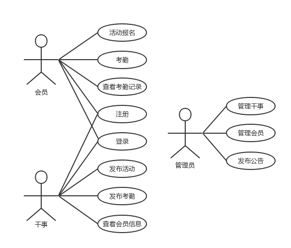  
                   图1.1  用例图  
如用例图所示，各类用户角色可进行如下操作：  
（1）会员：活动报名、考勤、查看考勤记录、注册、登录。  
（2）干事：登录、发布活动、编辑活动、发布考勤、查看考勤名单、导出考勤名单。

###1.3 用例规约
####1.3.1 会员注册
#####1.简要描述  
本用例允许用户在平台进行注册。  
#####2.参与者  
社团管理系统会员及干事。  
#####3.场景描述  
注册时需要用户根据系统的提示填写姓名、学号、手机号码、登录密码等个人信息。  
#####4.前置条件  
用户申请成为会员。  
#####5.后置条件  
用户注册成功后成为会员。  
#####6.事件流    
######（1）基本事件流  
a）用户选择注册。  
b）系统返回一个注册页面。  
c）用户根据提示信息输入相应的注册信息（姓名、学号、手机号码、登录密码）。  
d）系统验证用户输入成功。  
e）用户提交注册信息。  
f）系统提示注册成功并返回系统首页，此时默认已登录。  
######（2）异常事件流  
a）用户输入信息和系统验证不一致（如密码不符合系统设置等），系统给出相应的提示信息并返回注册页面。  
b）用户输入的用户名是已注册的成员名，系统给出提示并返回注册页面。
c) 选择取消，返回注册页面  
d）系统异常，无法注册，并给出相应的信息  
####1.3.2 考勤
#####1.简要描述  
到场参与活动的会员用微信扫描一次性二维码进行活动签到。  
#####2.参与者  
社团管理系统会员。  
#####3.场景描述  
社团干事登录系统并发起签到，该系统随机生成一次性二维码，会员们通过扫描此二维码进行签到。  
#####4.前置条件  
社团干事登录系统并发起签到。  
#####5.后置条件  
若本用例成功，系统将依据考勤信息将到场参与活动的会员信息同步到数据库，并赋予会员查看考勤信息的权限；否则，系统权限将不发生变化。  
#####6.事件流  
######（1）基本事件流
a)用户选择考勤。
b)系统返回用户一个一次性二维码。  
c)用户扫描二维码后系统检测用户登录。  
d)系统检测该用户为此次活动成员。  
e)考勤成功，并更新考勤记录。  
######（2）异常事件流  
a)一次性二维码失效，二维码进行失效处理。  
b)扫描二维码后检测到该用户未登录，用户进行登录。  
c)该用户不是本次活动成员，错误反馈。  
d)因其他原因（如超过考勤时间进行考勤等）导致考勤失败，错误反馈。  

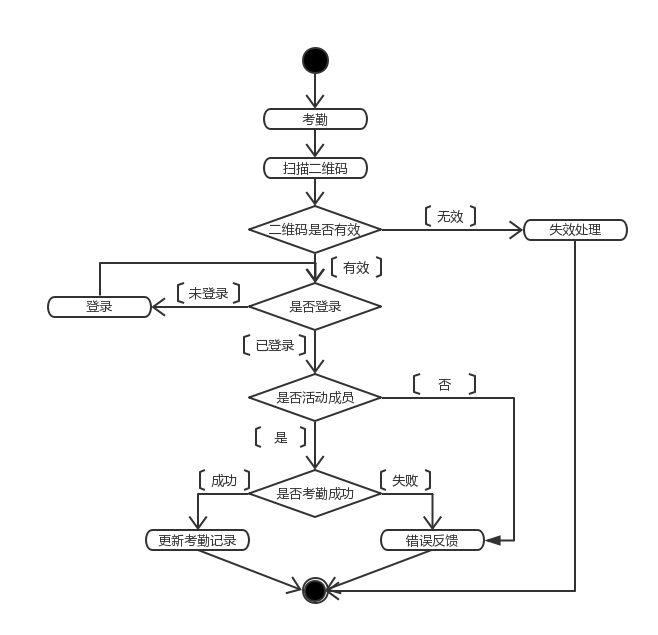   
               图1.2  考勤活动图  
####1.3.3 发布活动  
#####1.简要描述  
本用例允许已登录的社团干事在平台发布活动，包括活动时长、活动介绍、活动标签、活动时间、地点、面向人群等相关信息。  
#####2.参与者  
已登录的社团干事。  
#####3.场景描述  
社团干事登录系统，获得发布活动权限进行活动发布。  
#####4.前置条件  
社团干事登录本系统。  
#####5.后置条件  
若活动发表成功，活动在系统的“社团活动”页面上显示出来；若失败，则不显示。  
#####6.事件流  
######（1）基本事件流  
a) 登录到本系统社团干事，选择创建活动。  
b)按照系统提示输入活动介绍、活动标签、活动时间、面向人群等基本信息。  
c)选择发布。  
d)显示发布结果，系统给出提示。  
######（2）异常事件流  
a) 发布活动输入字数过少或超过规定字数。  
b) 必填信息未填写完毕。  

####1.3.4 活动报名  
#####1.简要描述  
本用例允许用户报名参加特定活动。  
#####2.参与者  
社团管理系统会员。  
#####3.场景描述  
社团在校园内公布社团活动时，用户通过活动详情页面点击“报名”按钮进行报名。  
#####4.前置条件  
该用户为社团会员。  
#####5.后置条件  
若该用例成功，系统将依据成功报名所生成的名单同步到数据库。  
#####6.事件流  
######（1）基本事件流    
a) 用户选择活动报名。  
b) 系统检测用户是否登录，用户已登录，报名成功。  
c) 用户成功报名后，系统将该用户信息加入活动名单。  
d) 系统更新名单显示。  
######（2）异常事件流  
a)系统检测到该用户未进行登录，继续检测是否注册会员，若是，则进行登录；若否，则进行会员注册。    
b)用户注册信息不正确导致注册失败。  
c)用户重复注册导致注册失败。  
d)用户因为其他原因（如超过报名时间、报名人数已满）导致报名失败，系统将进行错误反馈。  
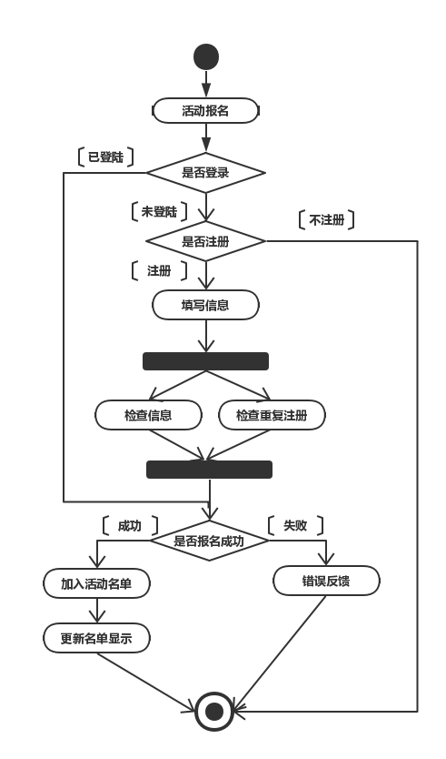  
           图1.3  活动报名活动图  
####1.3.5 查看会员信息  
#####1.简要说明  
本用例允许已登录的干事查看用户信息。  
#####2.参与者  
已登录的干事。  
#####3.场景描述  
会员和社团干事可以查看、修改用户登记的个人信息，包括：姓名、学号、密码、Email、手机号码等基本信息。同时，允许社团管理员搜索查看所有注册成员信息、删除注册成员信息。  
#####4.前置条件  
社团干事成功登录系统。  
#####5.后置条件  
查看或修改成功，返回管理后台首页。  
#####6.事件流  
######（1）基本事件流  
a) 用例开始于用户选择查看、修改个人信息。  
b) 检查登录者身份。  
c) 进入所属权限的信息管理界面。  
d) 对相关信息进行查看、修改或删除等操作。  
e) 保存操作的结果。  
f) 返回所属权限的信息管理界面。  
######（2）可选事件流：点击取消，返回所属权限的信息管理界面。  

###1.4 术语表  
| 名词术语 | 定义 |
|------------|-----------|
| 数据库| 数据库指的是以一定方式储存在一起、能为多个用户共享、具有尽可能小的冗余度的特点、是与应用程序彼此独立的数据集合。在本文中特指数据库管理系统所管理的数据库。 |
| 用户名 | 包括管理员、干事以及会员登录时候填写的名称 |
| 密码 | 包括管理员、干事以及会员登录时候填写的口令 |
| 干事 | 处理社团日常事务的人员 |
| 会员 | 通过注册的用户，允许申请加入到社团活动中 |
| 管理员 | 社团决策者 |
| 社团活动 | 由干事添加的关于该社团的活动消息 |  

##二、架构设计
###2.1 架构描述
会员管理系统采用MVVM（Model-View-ViewModel）三层架构，该架构的使用实现了应用程序的分层管理，简化后续对程序的修改和扩展，并且使程序某一部分的重复利用成为可能。模型层（Model）根据需求从数据库中获取所需要的数据；视图层（View）负责显示用户界面及相关数据并对用户输入进行反馈；视图模型层（ViewModel）是模型层与视图层的连接层，从模型层获取数据后形成视图层所需要的数据结构与视图层双向绑定。当视图层/视图模型层数据发生改变，视图模型层/视图层也会同步改变，当数据改变后，视图模型层则操作模型层对数据库进行更改。  
   
                图2.1  系统架构图  
###2.2 关键抽象
经过分析，本系统有3个实体类，分别为用户表、活动表、考勤记录表。
用户表：储存用户基本信息，包括账号、密码、个人资料等；
活动表：储存活动相关信息，包括标题、开始时间、截止时间、地点等；
考勤记录表：储存每项活动的考勤记录。  
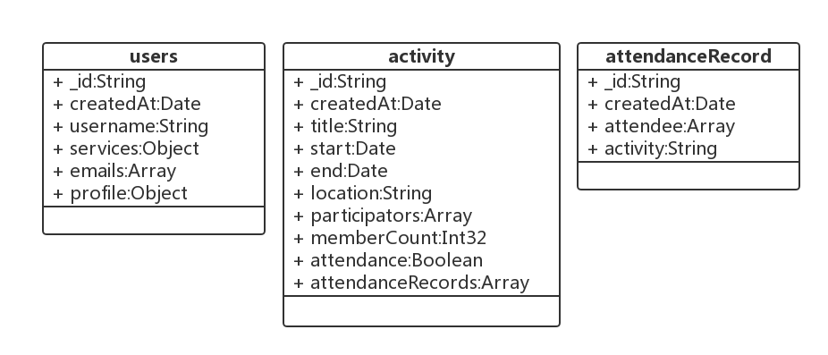   
                  图2.2  实体类图  
##三、用例分析  
###3.1 注册用户用例分析  
在注册用户的用例中，会员或干事通过“注册”按钮向SigninPages边界类发出注册账号的请求，Signup控制类收到请求后，给出注册页面，调用handleSubmit()方法提交用户注册信息，调用checkUser方法对用户填写的信息如姓名、密码、学号等进行验证，若注册信息有误则提示修改，成功则通过console连接到数据库，使用log()方法检查数据库中是否已存在该注册用户，返回结果到Signup类，Signup调用console中的createUser()方法将结果插入数据库，console返回成功信息到Signup，显示注册成功页面。  
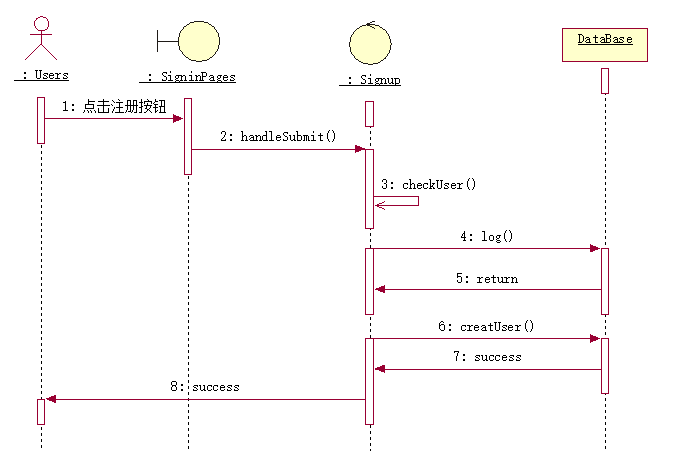   
###3.2 会员签到用例分析
在会员签到的用例中，会员通过边界类ActivityPage选择要签到的活动，再通过控制类ActivityDetail点击“签到”按钮，调用控制类的handleQRShow()方法，向用户展示一个签到二维码。会员扫描二维码，通过TakeAteendance实体类调用componentWillMount()方法检测会员的注册登录情况，并返回。会员再通过TakeAteendance实体类调takeAttendance()方法进行签到，返回签到成功信息到会员。  
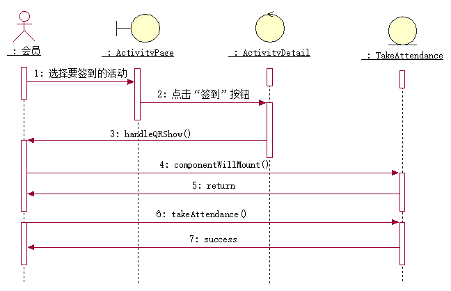    
###3.3 发布活动用例分析
在发布活动的用例中，干事通过HomePage的“+”按钮，系统调用ActivityEdit实体类的componentWillMount()方法验证账户信息，实体类调用CheckValidation()方法检查输入的活动信息是否符合标准后，调用handleSubmit()方法将活动信息传给connection实体类，实体类使用insert()方法将新建的活动插入数据库，并返回实体类创建活动的干事id，最终返回新建活动成功信息给干事。  
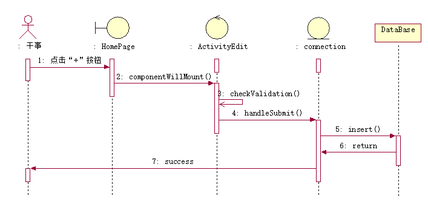    
###3.4 活动报名用例分析
在活动报名的用例中，会员通过向HomePage边界类发出点击报名活动的请求，边界类向ActivityDeatail控制类发出打开活动详情的请求后，向会员发出是否参加活动的确认，会员返回一个确认。ActivityDeatail类调用handleApply()方法检查会员的登陆情况，调用checkIsApplied()方法检查会员是否报名过该活动并返回一个确认。更新Records类中的活动报名名单，并传入数据库，返回成功信息到会员，并显示报名名单。  
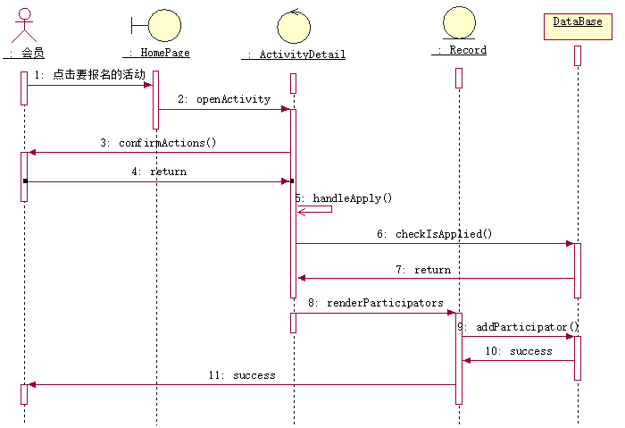  
###3.5 分析机制
经分析，会员管理系统中类的分析机制如下表所示：  
| 分析类 | 分析机制 |
|------------|-----------|
| HomePage| 持久性 |
| SigninPages | 持久性 |
| Signup | 持久性、安全性 |
| ActivityPage | 持久性 |
| ActivityDetail | 持久性、安全性 |
| TakeAttendance | 持久性 |
| ActivityEdit | 持久性 | 
| connection | 持久性、安全性 | 
| Records | 持久性、安全性 |  
###3.6 合并分析类  
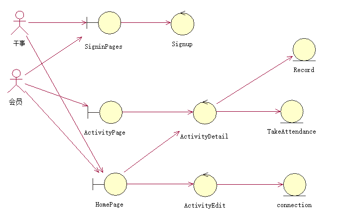   
##四、子系统及其接口设计  
###4.1 确定设计类  
对第三部分的分析类进行了分析与检查，以确定其是否能成为设计类。经过分析发现，第三部分的所有分析类均为单逻辑，不需要进行类的分解或合并，因此不做修改，所以设计类如第三部分所示。  

###4.2 定义子系统  
经过分析，本系统无需进行子系统设计及其接口设计。  

##五、分析系统并发需求  
###5.1 分析系统并发需求  
在一个系统中，并发性往往是至关重要的。因为如果有多个CPU（Central Processing Unit）可供使用，则并行地执行任务可以提高系统性能，同样系统的并发性也可以用来响应外部的随机发生的事件，并发性也可以增强系统的控制能力。  
系统的并发需求主要来源于以下几个方面：系统分布运行的程度、系统事件驱动的程度、关键算法的计算密度、运行环境支持的并发执行的程度。  
常用的并发机制有以下几种：多进程，应用程序在多个CPU上并行执行；多任务：操作系统通过间断性地执行不同的任务来实现并发。基于应用程序的并发：应用软件在适当的时间转入到不同的分支中。  
系统运行时可能产生的并发需求：报名人数超过招募人数。  

###5.2 针对报名人数问题的解决方案设计  
本系统采取的解决方案为：在干事进行创建活动的时候，对参加活动的最大人数进行了限制，当超过干事声明的最大人数时，会员报名活动无法成功。
###5.3 生命周期  
在本系统中，后台采用Node.js搭建，Node.js 采用事件驱动和异步 I/O 的方式,实现了一个单线程、高并发的 JavaScript 运行时环境,只有在处理I/O操作时会创建新线程进行异步操作，并将该服务请求排到队尾，I/O操作结束后新线程结束。  
  
##六、UI设计及功能展示    
###6.1 普通用户  
   
                  登录注册页面  
  
          主页面，展示已创建活动和可报名活动  
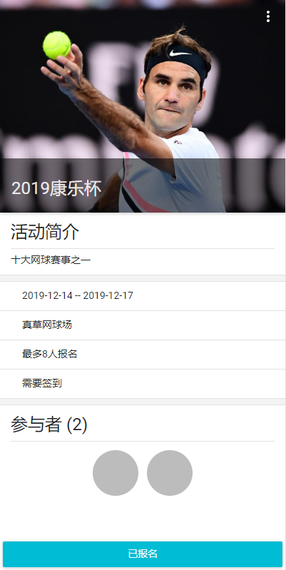  
      活动详情页面，可查看活动详情，并报名活动  
###6.2 管理员(在数据库users中将permission改成0即为管理员权限)  
  
             多了一个`+`按钮，可添加活动  
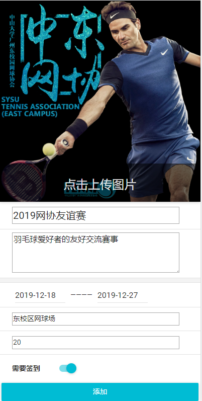   
			       创建活动  
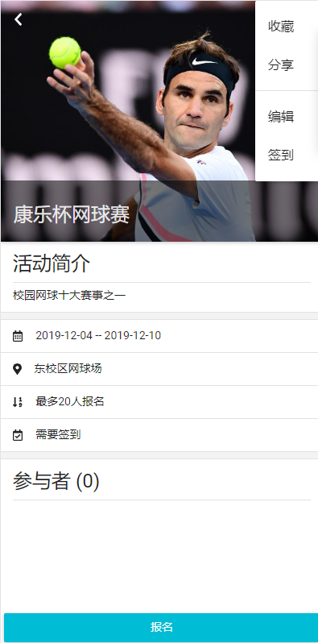   
                 右上角签到功能  
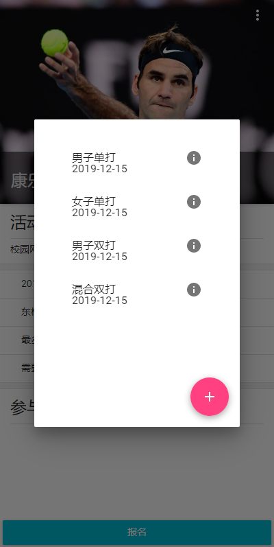   
			    右下角可添加签到   
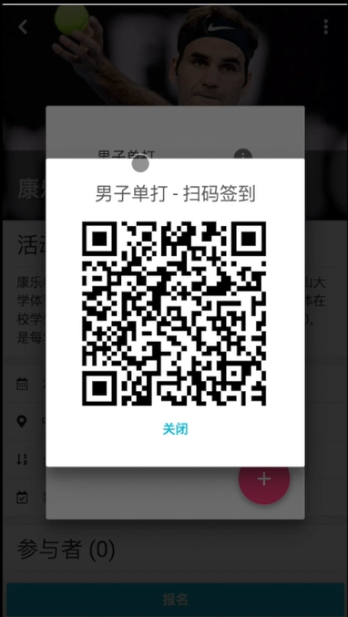   
             点击文字即可打开二维码   
###6.3 用户管理员共享  
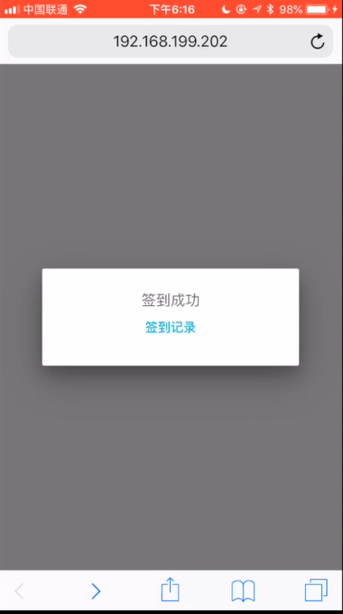   
       扫码后签到成功(功能尚不完善，偶尔会出错)  
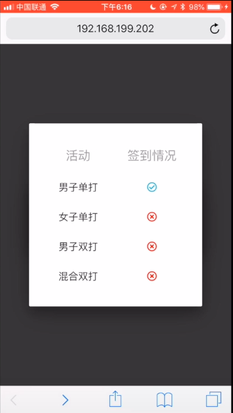  
                   即时签到情况    
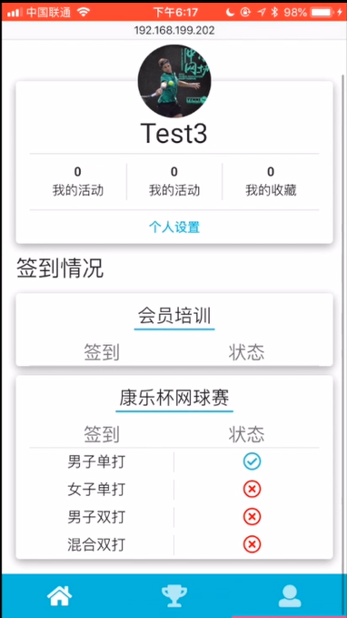  
                    个人状态资料  

